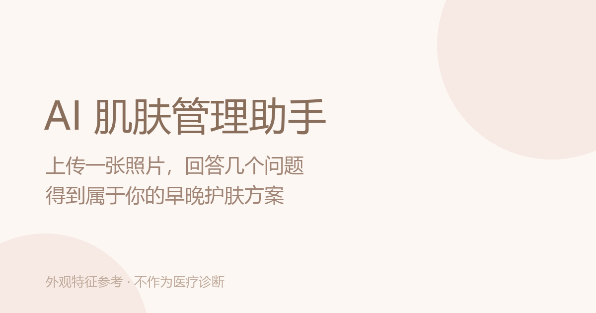

# AI 肌肤管理助手 · Skin Advisor

> 上传一张自拍，回答几个问题，得到一套可执行的早晚护肤方案 —— 附带预算内的产品清单、分区热力图、可分享的结果卡片。

一个从零做起的完整 Web 产品：前端 + 图像分析服务 + 推荐引擎。**不是 demo，是能跑通的完整闭环。**

<p align="center">
  
</p>

**在线体验**：https://6b0d502a49e648ce83dc8302acf4274c.sg2.agentos-app.run

---

## 它解决什么问题

市面上的护肤建议要么太泛（"多喝水、早睡觉"），要么太贵（导购只想卖你东西）。

这个工具做的是：**把你的皮肤状况和你的预算对齐**。预算 100 元就只推荐 100 元以内的组合，并且明确告诉你"这个预算装不下防晒，白天出门建议另备一支"——不硬凑，也不假装什么都能满足。

---

## 功能

- **图像特征分析** — MediaPipe Face Mesh 定位 468 个人脸关键点，输出 7 个维度的外观特征分值（泛红 / 出油 / 纹理 / 毛孔 / 瑕疵 / 水润 / 色素），并生成 7 张可叠加在原图上的半透明热力图
- **问卷驱动方案** — 6 个困扰维度 + 预算档位，即使没有图像分析也能完整出方案
- **推荐引擎** — 按"必备品类先占位、剩余预算补功效"的顺序选品，保证方案内部一致、绝不超预算
- **两套方案对比** — 高性价比方案（少而精）vs 完整方案（覆盖全）
- **早晚流程编排** — 面膜/去角质只排晚上，防晒只排早上
- **可分享结果卡片** — Canvas 原生绘制 750×1120，手机上长按即可保存
- **大模型文案润色（可选）** — 兼容任意 OpenAI 协议的服务，没配 Key 也能完整使用

---

## 技术栈

| 层 | 选型 |
|---|---|
| 前端 | Next.js 14（App Router）· React 18 · TypeScript · Tailwind CSS |
| 图像分析 | FastAPI · OpenCV · MediaPipe Face Mesh · scikit-image |
| 大模型 | 可插拔（DeepSeek / 智谱 / Ollama / 任意 OpenAI 兼容服务） |

**前端运行时依赖只有 3 个**：`next`、`react`、`react-dom`。
没有 UI 组件库、没有图表库、没有 `html2canvas`——分享卡片是手写 Canvas 2D 绘制的。

---

## 架构

```
浏览器
  │
  ├─ /api/scan    ──→  FastAPI 图像分析服务 (127.0.0.1:8000)
  │                       └─ MediaPipe → 7 维分值 + 7 张热力图
  │
  └─ /api/advice  ──→  大模型（OpenAI 兼容协议，可换厂商）
                          └─ 只补文案，不参与选品
```

**一个刻意的设计**：大模型**不参与选品**。商品永远是由规则引擎按预算从商品库选出来的，
AI 只负责写"这步怎么用""这段时间重点是什么"。这样即使模型抽风，也不会推荐出错的东西。

---

## 推荐引擎的几个关键决策

这部分是整个项目里最费心思的地方。

**1. 必备品类先占位，且按剩余预算挑**

洁面 / 保湿 / 防晒 / 爽肤水是任何流程的必备项，不该因为"没命中用户某个困扰"就被跳过。
占位顺序是 `洁面 → 保湿 → 防晒 → 爽肤水`，预算不够时**排在后面的先被放弃**。
挑选每一件时用的是**剩余预算**而非总预算，否则几件加起来必然超支。

**2. 商品清单与早晚流程共用同一套商品**

早期版本这两者是各自独立选品的，结果方案卡片写"1 件 ¥69"，流程里却出现 3 件商品——
用户看到的价不是实际要付的钱。现在它们同源，用 `buildRoutineFromItems()` 从同一份清单生成流程。

**3. 装不下就明说，不硬凑**

预算 100 元时，洁面 39 + 保湿 39 + 防晒 59 = 137，物理上装不下防晒。
这时界面会显示"白天出门建议另备一支"，而不是塞一个超预算的商品进去。

**4. 热力图区分语义方向**

7 个维度里有 6 个是"越高越需关注"，只有"水润"是越高越好。
同屏显示"水润 · 85"会被误读成糟糕，所以加了 `higherIsBetter` 标记显式区分。

**验证**：`npm run diag` 覆盖 144 种输入组合 × 2 套方案 = 288 套方案，
检查空方案 / 单品方案 / 清单与流程不一致 / 超预算，均为 0。

---

## 快速开始

```bash
git clone <repo>
cd skin-ai
npm install
npm run dev          # → http://127.0.0.1:3000
```

**不需要任何 Key 就能完整跑通。** 图像分析和大模型都会自动降级：
前者用问卷推断肤质，后者沿用规则生成的文案。

### 可选：启用真实图像分析

```bash
cd skin-scan-backend
python -m venv .venv && .venv/Scripts/activate
pip install -r requirements.txt
python -m uvicorn src.app.main:app --host 127.0.0.1 --port 8000
```

### 可选：启用大模型文案

复制 `.env.local.example` 为 `.env.local`，填入：

```bash
LLM_PROVIDER=deepseek        # deepseek / zhipu / ollama / openrouter / custom
LLM_API_KEY=sk-...
```

---

## 项目结构

```
src/
├─ app/
│  ├─ api/scan/        图像分析代理
│  ├─ api/advice/      大模型文案（可插拔厂商）
│  ├─ sitemap.ts       搜索引擎
│  └─ robots.ts
├─ components/
│  ├─ analyzing-view.tsx   分析进度
│  ├─ questions-view.tsx   问卷
│  ├─ result-view.tsx      结果页
│  └─ share-card.tsx       分享卡片（Canvas 手绘）
├─ lib/
│  ├─ mockEngine.ts        推荐引擎（核心）
│  ├─ scanClient.ts        图像分析客户端
│  └─ adviceClient.ts      大模型结果合并
└─ products.json           商品库
```

---

## 免责声明

本项目输出的是**外观特征参考**，不是医疗诊断，不可用于诊断或治疗目的。
商品数据为结构化示例，价格与成分为示意内容，**不是真实商品信息**。
商业化使用前必须替换为真实商品数据，并自行确认广告与化妆品功效宣称的合规要求。

## License

MIT
